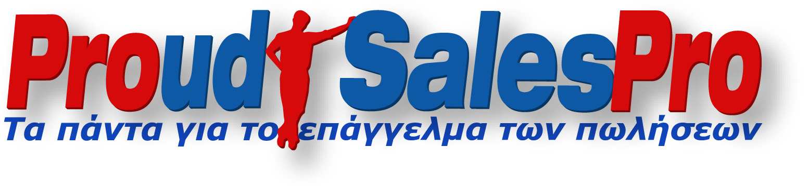
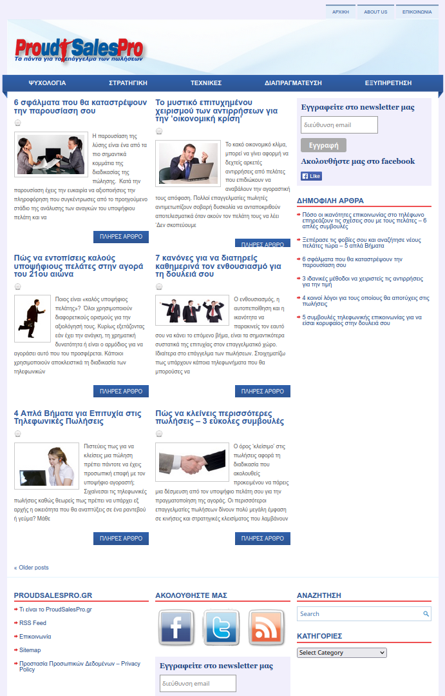
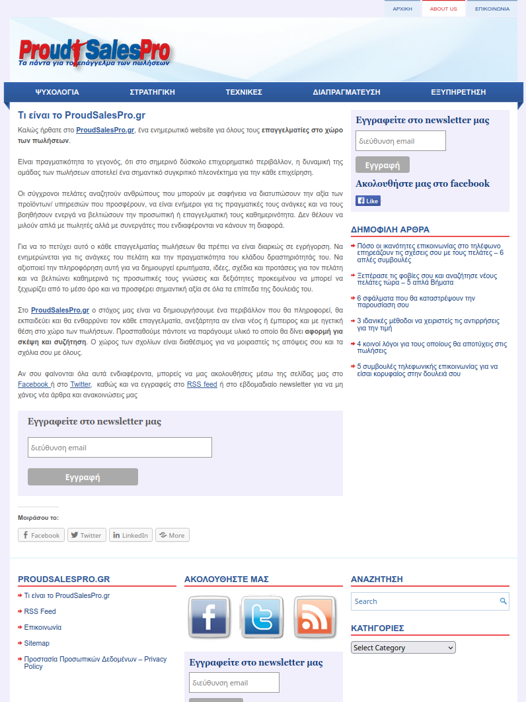
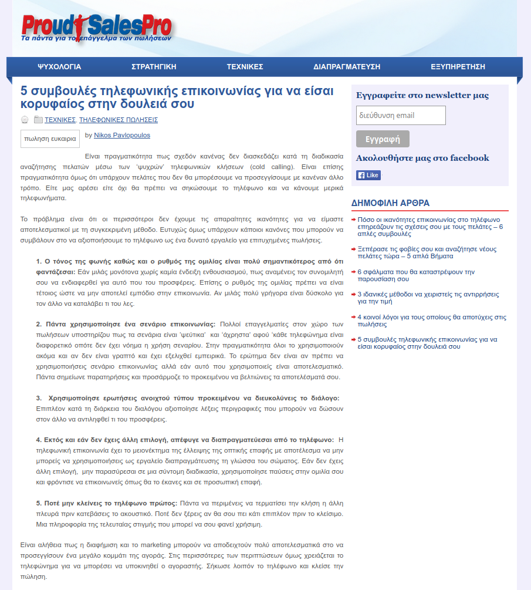
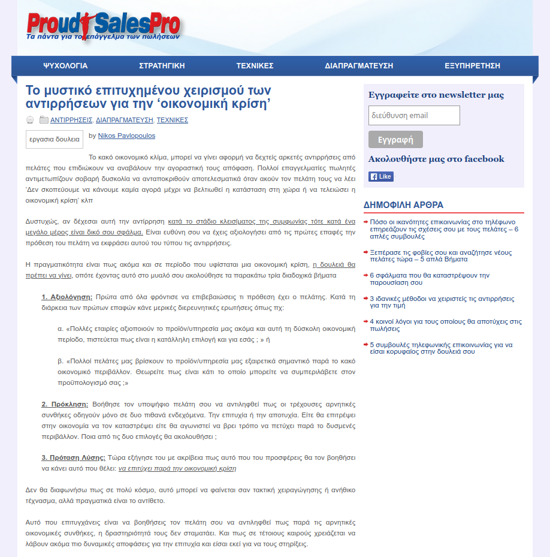
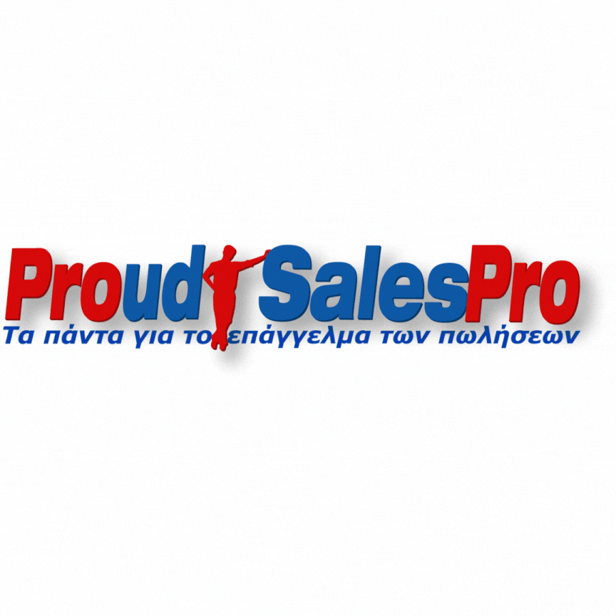

  

# ProudSalesPro Blog

**Personal Blog Project • 2012–2022**  
*A self-hosted **WordPress** blog focused on professional Sales topics, used as a personal branding tool and learning playground for web publishing, design customization, automation, SEO, and content strategy.*

> ⚠️ **Note**: This project is no longer maintained. The original domain `proudsalespro.gr` expired in 2022. An archived version is available via [Wayback Machine](https://proudpro.gr). or by visiting [proudpro.gr](https://proudpro.gr) (it is set up to redirect to the web archive site)

---

## 🧱 Project Overview & Goals

This project began in **October 2012** as a way to deepen my knowledge of Sales, build my personal brand, and experiment with web technologies.

The blog ran actively until **December 2013**, and later on with minimal maintenance (mostly hosting and minor plugin updates) until 2022. It was never intended as a commercial project, but it helped me:

- Learn to publish and manage web content professionally
- Practice HTML/CSS modifications
- Learn how to automate workflows and manage basic SEO

---

## 🎨 Design & Theming

The site was originally based on a **free minimalistic WordPress theme**, which I adjusted to meet my visual standards using:

- **HTML and CSS** (via WordPress's Customizer and direct file edits)
- [**Inkscape**](https://en.wikipedia.org/wiki/Inkscape) for logo design (vector graphics)
- Manual editing of headers, sidebars, and typography

> ✅ Screenshots:
> - 
> - 

---

## 🧩 CMS & Hosting Details

- **Platform**: [**WordPress**](https://en.wikipedia.org/wiki/WordPress) (self-hosted)
- **Hosting Provider**: [**DreamHost**](https://en.wikipedia.org/wiki/DreamHost) shared hosting
- **Active Period**: 2012–2022
- **Key Plugins Used**:
  - [Yoast SEO](https://yoast.com/seo-blog/) – for basic metadata and search visibility
  - [WP Super Cache](https://wordpress.org/plugins/wp-super-cache/) – for performance optimization

---

## 📰 Content Writing Strategy

All articles were **written from scratch** between 2012 and 2013 (pre-AI era).

### Research Workflow:

To support idea generation and stay on top of sales trends, I created a **custom article database** using a now deprecated scraping tool called [**Visual Web Ripper**](https://refinepro.com/toolbox/visual_web_ripper/):

- Scraped thousands of URLs and article titles from sites like *Harvard Business Review*, *Inc.*, and other sales blogs
- Data included: title, source, link, and keyword tags
- Used the dataset to categorize articles, inform reading, and inspire blog posts

### SEO Results:

Despite only basic keyword inclusion and minimal metadata work, two key articles ranked on Google's **first page** (in Greek SERPs) for several years (2014–2020):

- [**"Τηλεφωνικές Πωλήσεις" (Telephone Sales)**](https://web.archive.org/web/20161118113211/http://www.proudsalespro.gr/5-symvoules-tilefwnikis-epikoinvnias-gia-na-eisai-koryfaios-stin-douleia-sou/)  
  -   
   
- [**"Χειρισμός Αντιρήσεων" (Objection Handling)**](https://web.archive.org/web/20160911050935/http://www.proudsalespro.gr/to-mystiko-gia-epityximeno-xeirismo-antirrhsevn-peri-oikonomikhs-krisis/)  
  -   

### Ad Monetization:

- Integrated **Google AdSense**
- Ads were placed in the sidebar and inside articles
- Monetization was minimal, but helped offset hosting costs

---

## 🤖 Automation & Newsletter Campaigns

A fully automated **weekly curated newsletter** was created using:

- [**IFTTT**](https://en.wikipedia.org/wiki/IFTTT) – to detect articles tagged with `"psp"` in RSS feed readers
- [**Google Reader**](https://en.wikipedia.org/wiki/Google_Reader) (defunct since 2013, yes I am old), later replaced by **Feedly**
- [**Mailchimp**](https://en.wikipedia.org/wiki/Mailchimp) – used a pre-designed newsletter template

### Workflow:

1. I read several articles weekly in Feedly  
2. When I found something useful, I tagged it `"psp"`  
3. IFTTT detected the tag → compiled title + link + excerpt  
4. Mailchimp automatically populated the newsletter template  
5. Newsletter sent every **Sunday**, without manual intervention

---

## 📎 Final Notes and Screenshots Overview

This blog was a **learning playground** for me at the start of my career. Although it’s no longer online, I credit it with teaching me the foundations of:

- **HTML/CSS editing**
- **CMS usage and plugin ecosystems**
- **SEO, content research & curation**
- **Workflow automation using APIs (IFTTT, Mailchimp, RSS)**
- **Content writing and user engagement strategies**

A few representative visual assets have been preserved and are stored in the [`assets/`](assets/) directory of this repository:

